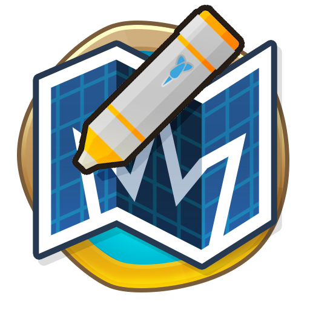
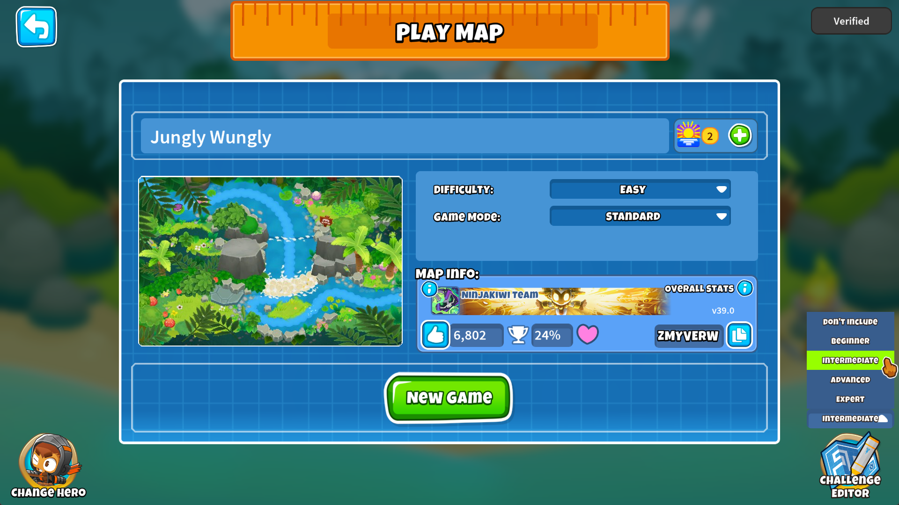
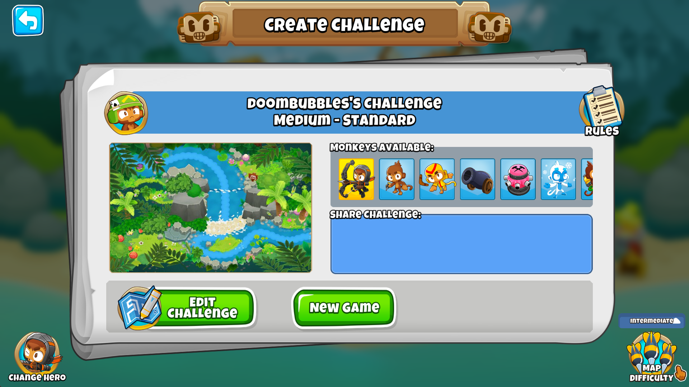
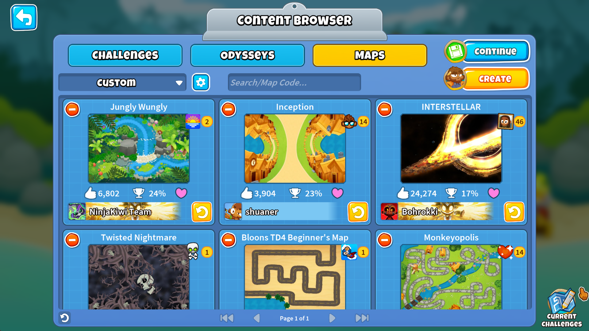
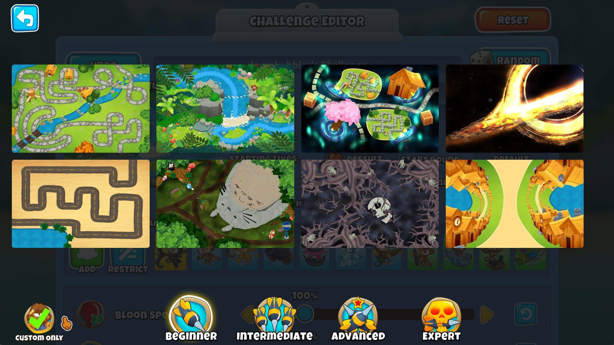

<h1 align="center">

Custom Map Challenges
</h1>

### Use Custom Maps in the Challenge Editor and Boss Challenges

Unlike the normal content browser, you can choose which difficulty you want to use the map as.
Map Difficulty primarily affects Hero Level up speed.
Beginner: 1.0x XP, Intermediate: 1.1x XP,
Advanced 1.2x XP, Expert: 1.3x XP.
Custom Maps in the browser always use Intermediate.

### Enable a Custom Map for Challenge Use

### Play a Challenge With It

### Filter Your Current Challenge Enabled Custom Maps

### More Info

This mod keeps copies of the maps you choose in the default folder `%USERPROFILE%\AppData\LocalLow\Ninja Kiwi\BloonsTD6\CustomMapChallenges`.
You can also directly copy map files from the browser storage folder `%USERPROFILE%\AppData\LocalLow\Ninja Kiwi\BloonsTD6\MapEditor_ContentData` into there if you so desire.
The subfolder of `Beginner` / `Intermediate` / `Advanced` / `Expert` will determine what difficulty it is loaded as (default Intermediate if no subfolder).
New maps added in the folder will be loaded in immediately, not requiring a game start.

